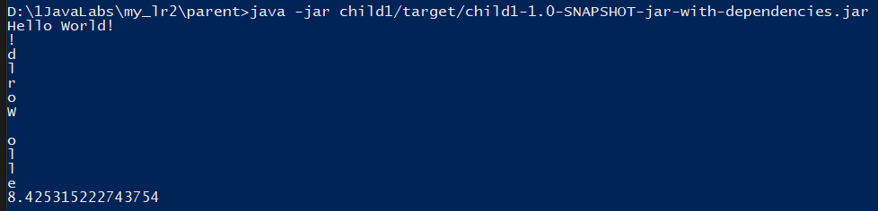

=== *Отчёт по лабораторной работе 2*

Студент: Зернов И.В.

Группа: ПИМ-22

==== 1. Постановка задачи

1. Создать несколько maven-проектов:
    - Родительский
    - 2 Дочерних (1 дочерний проект зависит от второго)
2. Подключить внешнюю зависимость (из глобального репозитория) в один из проектов и продемонстрировать работу этой зависимости.
3. Создать maven-проект, который будет помещен в локальный репозиторий. Добавить этот проект как зависимость в проект из п.1
4. Создать maven-проект, упаковать его в jar-with-dependencies, продемонстрировать рабту jar. Запустить проект с помощью maven.
5. Выполнить тест подключенной зависимости из п.2 с помощью junit

==== 2. Структура проекта

Проект разделён на следующие директории

. *parent* - родительский класс проекта, содержит **classes, src, manifest.mf**;
. *adopted* - проект в локальном репозитории
. *child1* - первый дочерний проект, в зависимости от *child2*
. *child2* - второй дочерний проект, в зависимости от *adopted*

==== 3. Информация о реализации

Прокет создавался используя следующие команды:

. Создание родительского проекта, используя официальный шаблон Maven:

    D:\1JavaLabs\my_lr2\>mvn archetype:generate -DgroupId=ru.rsatu -DartifactId=parent -DarchetypeArtifactId=maven-archetype-quickstart -DarchetypeVersion=1.4 -DinteractiveMode=false

. Создание дочерних проектов внутри родительского:

    D:\1JavaLabs\my_lr2\parent>mvn archetype:generate -DgroupId=ru.rsatu -DartifactId=child1 -DarchetypeArtifactId=maven-archetype-quickstart -DarchetypeVersion=1.4 -DinteractiveMode=false

    D:\1JavaLabs\my_lr2\parent>mvn archetype:generate -DgroupId=ru.rsatu -DartifactId=child2 -DarchetypeArtifactId=maven-archetype-quickstart -DarchetypeVersion=1.4 -DinteractiveMode=false

. Создание локального репозитория:

    D:\1JavaLabs\my_lr2\parent>mvn archetype:generate -DgroupId=ru.rsatu -DartifactId=adopted -DarchetypeArtifactId=maven-archetype-quickstart -DarchetypeVersion=1.4 -DinteractiveMode=false

При использовании данного шаблона автоматически в родительской и дочерних папках появляются _pom.xml_ файлы.

==== 4. Выполнение задания

Для выполнения задания был изменён pom.xml файл "родителя": 
[source,xml]
--
    <?xml version="1.0" encoding="UTF-8" standalone="no"?>
    <project xmlns="http://maven.apache.org/POM/4.0.0" xmlns:xsi="http://www.w3.org/2001/XMLSchema-instance" 
    xsi:schemaLocation="http://maven.apache.org/POM/4.0.0 http://maven.apache.org/xsd/maven-4.0.0.xsd"> 
      <modelVersion>4.0.0</modelVersion>   
      <groupId>ru.rsatu</groupId>    
      <artifactId>parent</artifactId>    
      <version>1.0-SNAPSHOT</version>
      <packaging>pom</packaging>      
      <name>parent</name>        
      <properties>
        <project.build.sourceEncoding>UTF-8</project.build.sourceEncoding>
        <maven.compiler.source>1.7</maven.compiler.source>     
        <maven.compiler.target>1.7</maven.compiler.target>   
      </properties>   
      <modules>     
        <module>child1</module>       
        <module>child2</module>          
      </modules>        
      <build>
        <plugins>
          <plugin>
            <artifactId>maven-assembly-plugin</artifactId>
              <configuration>
                <archive>
                  <manifest>
                    <mainClass>ru.rsatu.Main</mainClass>
                  </manifest>
                </archive>
                <descriptorRefs>
                  <descriptorRef>jar-with-dependencies</descriptorRef>
                </descriptorRefs>
              </configuration>
          </plugin>
        </plugins>
      </build>
    </project>
--
А также pom.xml файлы дочерних проектов, с условием, что они зависят от "родителя", а один из проектов зависит от второго.

*_Child1:_*
[source,xml]
--
<?xml version="1.0" encoding="UTF-8"?>
<project xmlns="http://maven.apache.org/POM/4.0.0" xmlns:xsi="http://www.w3.org/2001/XMLSchema-instance" xsi:schemaLocation="http://maven.apache.org/POM/4.0.0 http://maven.apache.org/xsd/maven-4.0.0.xsd">
  <modelVersion>4.0.0</modelVersion>
  <parent>
    <artifactId>parent</artifactId>
    <groupId>ru.rsatu</groupId>
    <version>1.0-SNAPSHOT</version>
  </parent>

  <groupId>ru.rsatu</groupId>
  <artifactId>child1</artifactId>
  <version>1.0-SNAPSHOT</version>

  <name>child1</name>
  <!-- FIXME change it to the project's website -->
  <url>http://www.example.com</url>

  <properties>
    <project.build.sourceEncoding>UTF-8</project.build.sourceEncoding>
    <maven.compiler.source>1.7</maven.compiler.source>
    <maven.compiler.target>1.7</maven.compiler.target>
    <exec.mainClass>ru.rsatu.parent</exec.mainClass>
  </properties>

  <dependencies>
    <dependency>
      <groupId>ru.rsatu</groupId>
      <artifactId>child2</artifactId>
      <version>1.0-SNAPSHOT</version>
    </dependency>
    <dependency>
      <groupId>junit</groupId>
      <artifactId>junit</artifactId>
      <version>4.13.1</version>
      <scope>test</scope>
    </dependency>
  </dependencies>

</project>
--

*_Child2:_*
[source,xml]
--
<?xml version="1.0" encoding="UTF-8"?>
<project xmlns="http://maven.apache.org/POM/4.0.0" xmlns:xsi="http://www.w3.org/2001/XMLSchema-instance" xsi:schemaLocation="http://maven.apache.org/POM/4.0.0 http://maven.apache.org/xsd/maven-4.0.0.xsd">
  <modelVersion>4.0.0</modelVersion>
  <parent>
    <artifactId>parent</artifactId>
    <groupId>ru.rsatu</groupId>
    <version>1.0-SNAPSHOT</version>
  </parent>

  <groupId>ru.rsatu</groupId>
  <artifactId>child2</artifactId>
  <version>1.0-SNAPSHOT</version>

  <name>child2</name>
  
  <properties>
    <project.build.sourceEncoding>UTF-8</project.build.sourceEncoding>
    <maven.compiler.source>1.7</maven.compiler.source>
    <maven.compiler.target>1.7</maven.compiler.target>
  </properties>

  <dependencies>
    <dependency>
      <groupId>org.apache.commons</groupId>
      <artifactId>commons-math3</artifactId>
      <version>3.6.1</version>
    </dependency>
    <dependency>
      <groupId>ru.rsatu</groupId>
      <artifactId>adopted</artifactId>
      <version>1.0-SNAPSHOT</version>
    </dependency>
    <dependency>
      <groupId>junit</groupId>
      <artifactId>junit</artifactId>
      <version>4.13.1</version>
      <scope>test</scope>
    </dependency>
  </dependencies>
    <build>
  <plugins>
    <plugin>
      <artifactId>maven-assembly-plugin</artifactId>
      <configuration>
        <archive>
          <manifest>
            <mainClass>ru.rsatu.Main</mainClass>
          </manifest>
        </archive>
        <descriptorRefs>
          <descriptorRef>jar-with-dependencies</descriptorRef>
        </descriptorRefs>
      </configuration>
    </plugin>
  </plugins>
</build>

</project>
--

Далее, перед тем как писать код внутри .java файлов проекта, необходимо сказать Maven'у, чтобы он загрузил все необходимые библиотеки, указанные в зависимостях, используя следующую команду:

    mvn install

После того как Maven установил всё необходимое, можно писать код внутри .java файлов проекта.

*_adopted_*
[source,xml]
--
package ru.rsatu;

public class Adopted
{
    public static void rand(String a) //функция берёт строку и переворачивает её посимвольно
    {
        int b = a.length();
        for (int i=b-1; i>=0;i--){
            System.out.print(a.charAt(i));
        }        
    }
}
--

Далее был написан файл, который вызывает внешний проект и проект, код которого написан выше.

*_child2_*
[source,xml]
--
package ru.rsatu;

import org.apache.commons.math3.distribution.NormalDistribution; //выбранная внешняя библиотека

public class Main_child2 
{
    public static void doSomething()
    {
        String H = "Hello World!";
        System.out.println(H);//печатает строку выше   
        adopted.rand(H);//переворачивает строку выше

        NormalDistribution normalDistribution = new NormalDistribution(10, 3);//показывает 
        double randomValue = normalDistribution.sample();       //нормальное распределение 
        System.out.println(randomValue);                        //числа 10 с отклонением 3
    }
}
--
 
И наконец создаётся файл для оставшегося проекта, который будет вызывать функцию child2.doSomething.

*_child1_*
[source,xml]
--
package ru.rsatu;

public class Main
{
    public static void main( String[] args )
    {
        Main_child2.doSomething();
    }
}

--

Чтобы создать jar-with-dependencies проекта, нужно вызвать следующую команду:

    mvn clean compile assembly:single

Чтобы проверить как работает программа необходимо запустить этот jar файл:

Во время сборки я вместо print, написал println, поэтому строка наоборот выглядит так. Пытался несколько раз пересобрать, но безуспешно.

При запуске используя Maven возникает следующая ошибка:

    [ERROR] Failed to execute goal org.codehaus.mojo:exec-maven-plugin:3.1.0:java (default-cli) on project child1: An exception occurred while executing the Java class. ru.rsatu.parent

==== 6. Вывод

Был получен навык создания проектов maven с использованием официальных шабонов, навык добавления к проекту зависимостей.
Не были получены навыки правильной сборки проектов maven. Я узнал что не понимаю синтаксис import'ов внутри файла, так как не смог написать тест программы используя junit.
 
